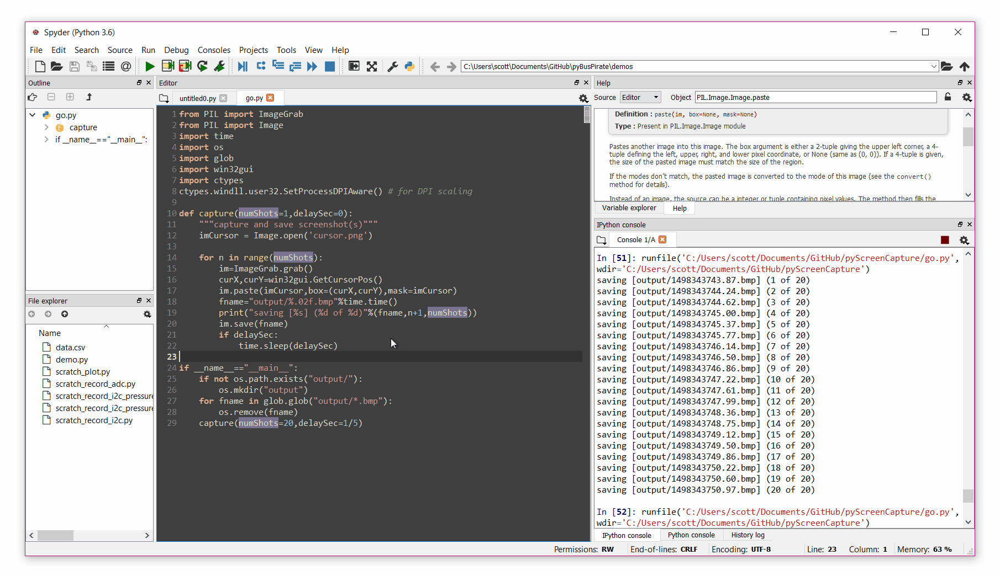

# pyScreenCapture
Screen capture video (with cursor) using Python.

## Features
* tested in Anaconda (Python 3) on Windows 10
* takes screenshots with [`PIL.ImageGrab`](http://effbot.org/imagingbook/imagegrab.htm)
* captures cursor with [win32gui.GetCursorPos()](https://msdn.microsoft.com/en-us/library/ms648390(VS.85).aspx)
* supports Windows DPI scaling using [`SetProcessDPIAware`](http://programtalk.com/python-examples/ctypes.windll.user32.SetProcessDPIAware/)

## Usage
1. **Capture:** Just run [go.py](go.py) and it will capture video as a series of BMP files and save them in the `./output/` folder. Modify the script to set the number of captures and the frame rate. 
2. **Edit/Crop:** Drag the entire `./output/` folder icon onto [FIJI / ImageJ](http://fiji.sc/) and it will open as an image sequence. You can then crop/modify the image (if desired). 
3. **Saving as GIF:** In [FIJI / ImageJ](http://fiji.sc/) click File > Save As > Animated GIF

## Demos

